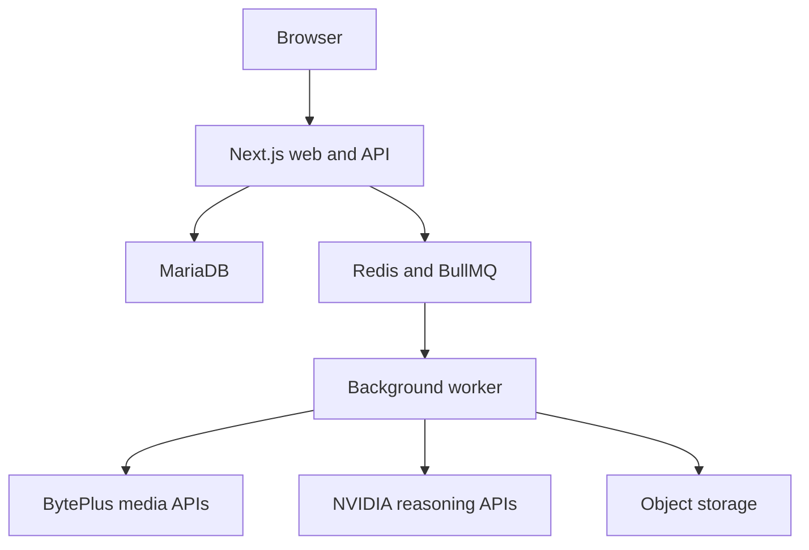

# Aiwa Creators Platform

A private AI creative workspace for Aiwa Media Group teams and client networks.

The platform will provide assisted image, video, and voice generation through BytePlus APIs, supported by NVIDIA-powered creative reasoning, story development, prompt enhancement, and workflow orchestration.

> **Project status:** Private-alpha foundation and interactive product demo
> **Staging:** [creator.aiwamediagroup.com](https://creator.aiwamediagroup.com)  
> **Repository:** [baba-dev/creator-platform](https://github.com/baba-dev/creator-platform)

## Product vision

Aiwa Creators Platform is being built as a practical creative production environment rather than a thin model playground.

Users will be able to:

- Choose image, video, or voice generation.
- Compare available models, capabilities, descriptions, and credit prices.
- Build creative briefs and storylines with an AI copilot.
- Upload reference assets and organize work into projects.
- Save brand kits, generation preferences, and reusable workflows.
- Track generation history, costs, outputs, and remaining credits.
- Work individually or through a shared organization account.

Administrators will be able to:

- Create and manage users, organizations, and team memberships.
- Record OMR cash and cheque payments.
- Grant credits after payment confirmation.
- Allocate internal budgets and per-user spending limits.
- Configure enabled models, pricing, margins, and usage caps.
- Inspect, retry, cancel, or refund generation jobs.
- Monitor BytePlus usage, provider cost, customer revenue, and gross margin.
- Review audit, moderation, and provider health events.

## Provider responsibilities

Provider boundaries are deliberate and must remain explicit.

### BytePlus

All customer-facing media generation is performed through BytePlus services:

- Image generation and editing
- Video generation
- Text-to-speech
- Future avatar and motion-generation capabilities

### NVIDIA

NVIDIA AI APIs are used for reasoning and creative assistance:

- Creative briefs
- Prompt improvement
- Storyline and storyboard generation
- Shot lists and scene timing
- Model recommendations
- Arabic and English localization
- Converting conversational requests into validated generation parameters

NVIDIA does not replace BytePlus as the media-generation provider.

## Architecture

The first release uses a modular monolith with a separately deployed background worker.



Long-running provider calls must never execute inside a browser request. The web application validates and reserves a job; the worker performs provider submission, polling, reconciliation, and asset persistence.

## Technology stack

| Area | Choice |
| --- | --- |
| Runtime | Node.js 24 LTS |
| Workspace | pnpm workspaces and Turborepo |
| Application | Next.js App Router and TypeScript |
| Interface | shadcn/ui, Tailwind CSS, and Lucide |
| Forms and validation | React Hook Form and Zod |
| Authentication | Better Auth with application-owned RBAC |
| Database | MariaDB |
| ORM and migrations | Prisma |
| Background processing | Redis and BullMQ |
| Media storage | S3-compatible object storage |
| Media generation | BytePlus ModelArk and Seed Speech |
| Creative reasoning | NVIDIA AI APIs |
| Testing | Vitest, React Testing Library, and Playwright |
| Deployment | Systemd, Nginx, immutable release archives, and GitHub Actions |
| Observability | OpenTelemetry and structured application logs |

Dependency versions will be pinned by the lockfile when the application bootstrap is committed.

## Interface system

The application uses the **Pencil & Pixel** light/dark design system: a warm
paper-and-graphite foundation with vivid creative accents and restrained sketch
details.

- Definitive implementation guide: [docs/design-system.md](docs/design-system.md)
- Living component and token reference: `/design-system`
- Semantic tokens: `apps/web/src/app/globals.css`

All new pages must use semantic colour tokens and be reviewed in both modes.

## Target repository layout

```text
creator-platform/
├── .github/
│   ├── workflows/
│   ├── CODEOWNERS
│   ├── dependabot.yml
│   └── pull_request_template.md
├── apps/
│   ├── web/
│   └── worker/
├── packages/
│   ├── ui/
│   ├── db/
│   ├── core/
│   ├── credits/
│   ├── providers/
│   │   ├── byteplus/
│   │   └── nvidia/
│   ├── validation/
│   ├── config/
│   ├── observability/
│   └── testkit/
├── docs/
│   ├── architecture/
│   ├── product/
│   ├── providers/
│   ├── finance/
│   ├── runbooks/
│   └── adr/
├── infra/
│   ├── deploy/
│   ├── nginx/
│   └── systemd/
├── AGENTS.md
├── compose.dev.yml
├── compose.production.yml
├── pnpm-workspace.yaml
├── turbo.json
├── .env.example
└── package.json
```

## Financial model

The platform uses an internal credit ledger. BytePlus provider units are never exposed as the customer's wallet currency.

Customer payments are collected manually in OMR:

1. A finance administrator records a cash or cheque payment.
2. Cash may be confirmed immediately.
3. Cheques remain pending until cleared.
4. A confirmed payment creates an immutable credit-ledger transaction.
5. Generation jobs reserve credits before provider submission.
6. Completed jobs capture the charge.
7. Failed or cancelled jobs release or refund the reservation.

Payment states:

```text
DRAFT -> PENDING -> CONFIRMED
                 -> REJECTED

CONFIRMED -> REVERSED
```

Corrections use reversal or adjustment transactions. Administrators must never directly overwrite a wallet balance.

## Financial and job invariants

These are non-negotiable implementation rules:

- Store OMR values as integer baisa.
- Store USD provider costs as integer micro-USD.
- Never use JavaScript floating-point values for money.
- Derive wallet balances from immutable ledger entries and maintain only a transactional cache.
- Lock the price version and exchange-rate snapshot when a quote is accepted.
- Reserve credits before submitting a billable provider request.
- Require an idempotency key for every generation and financial mutation.
- Persist the BytePlus request ID against the internal generation job.
- Reconcile every reservation into capture, release, refund, or manual-review state.
- Treat BytePlus usage as billable provider cost.
- Prevent customer spending beyond organization and platform caps.
- Record every administrative financial action in the audit log.

## Account model

The platform is organization-first.

An organization owns:

- Credit wallet
- Projects and generated assets
- Brand kits
- Members and roles
- Payment records
- Usage limits
- Generation history

Initial platform roles:

| Role | Responsibility |
| --- | --- |
| Platform owner | Full platform and configuration control |
| Platform administrator | Customer, model, and operational management |
| Finance administrator | Payments, credit grants, reversals, and reporting |
| Operator | Generation job and provider operations |
| Support | Read-only customer support with audited actions |
| Organization owner | Team, project, and wallet visibility |
| Organization member | Creative work within assigned limits |
| Organization viewer | Read-only access |

Administrative accounts will require multi-factor authentication before production launch.

## Generation lifecycle

```text
DRAFT
  -> QUOTED
  -> CREDIT_RESERVED
  -> QUEUED
  -> SUBMITTED
  -> PROCESSING
  -> SUCCEEDED
  -> FAILED
  -> CANCELLED
  -> MANUAL_REVIEW
```

Every transition is validated server-side and recorded with timestamps. Queue retries must be idempotent because a retried worker may run more than once.

Initial queues:

- `reasoning`
- `image-generation`
- `video-submit`
- `video-status`
- `voice-generation`
- `asset-ingestion`
- `provider-reconciliation`
- `notifications`
- `maintenance`

## Local development

The following workflow becomes available once the bootstrap milestone lands.

### Requirements

- Node.js 24 LTS
- Corepack
- Docker with Compose
- Git

### Start the development environment

```bash
git clone git@github.com:baba-dev/creator-platform.git
cd creator-platform

corepack enable
pnpm install
cp .env.example .env

docker compose -f compose.dev.yml up -d
pnpm db:migrate
pnpm db:seed
pnpm dev
```

Expected local services:

| Service | Purpose |
| --- | --- |
| Next.js web | User studio, admin console, and API |
| Worker | BytePlus and NVIDIA job processing |
| MariaDB | Persistent application and ledger data |
| Redis | Queues, locks, throttling, and ephemeral progress |
| Object-storage emulator | Local media development |

## Environment configuration

No real credentials may be committed. Copy `.env.example` to `.env`; the
example contains variable names and safe placeholders only.

Server-side configuration groups:

```dotenv
APP_URL=
AUTH_SECRET=
DATABASE_URL=
REDIS_URL=

BYTEPLUS_API_KEY=
BYTEPLUS_REGION=ap-southeast-1
BYTEPLUS_MODELARK_BASE_URL=
BYTEPLUS_SPEECH_API_KEY=
BYTEPLUS_SPEECH_APP_KEY=aGjiRDfUWi
BYTEPLUS_SPEECH_BASE_URL=
BYTEPLUS_SPEECH_APP_ID=
BYTEPLUS_SPEECH_ACCESS_TOKEN=
BYTEPLUS_REQUEST_TIMEOUT_MS=180000

NVIDIA_API_KEY=
NVIDIA_BASE_URL=
NVIDIA_REASONING_MODEL=

S3_ENDPOINT=
S3_REGION=
S3_BUCKET=
S3_ACCESS_KEY_ID=
S3_SECRET_ACCESS_KEY=

OTEL_EXPORTER_OTLP_ENDPOINT=
```

Provider credentials must never use the `NEXT_PUBLIC_` prefix.

### BytePlus live smoke test

After CI passes and the provider changes are merged, add the ModelArk key to
the untracked root `.env`. The image smoke test is deliberately billable and
will not run until its acknowledgement is set:

```dotenv
BYTEPLUS_API_KEY=your-modelark-api-key
BYTEPLUS_REGION=ap-southeast-1
BYTEPLUS_LIVE_SMOKE_ACK=I_UNDERSTAND_THIS_IS_BILLABLE
```

```bash
pnpm --filter @aiwa/worker smoke:byteplus
```

The command generates one 2K PNG, validates the download, and writes it with
owner-only permissions under `.data/byteplus-smoke/`. It never logs the API
key, prompt, or temporary provider output URL. Seed Speech uses a separate
`BYTEPLUS_SPEECH_API_KEY`; the legacy App ID/access-token pair remains available
only for accounts that have not migrated.

## Staging

The staging environment is hosted at:

**[creator.aiwamediagroup.com](https://creator.aiwamediagroup.com)**

Initial deployment target:

- Small Linux VPS
- Nginx reverse proxy and TLS termination
- Next.js standalone web process managed by systemd
- Bundled background worker managed by systemd
- Redis bound to localhost
- MariaDB with persistent storage and encrypted backups
- Remote S3-compatible media storage
- Immutable release archives identified by commit SHA

Staging deploys from the protected `main` branch after CI passes. GitHub builds the release, transfers it over SSH, and atomically activates it on the server. Production deployment will use an approved GitHub release tag and a separate environment.

## Development workflow

Use trunk-based development:

1. Create a short-lived branch such as `feat/manual-payments`.
2. Keep commits focused and use conventional commit messages.
3. Open a pull request against `main`.
4. Pass formatting, lint, type checking, unit, integration, and build checks.
5. Squash merge after review.
6. Delete the merged feature branch.

Financial-ledger, authentication, pricing, and provider-adapter changes require tests and review.

## Initial milestones

1. Repository and local-environment bootstrap
2. Authentication, organizations, and RBAC
3. Wallet ledger and manual OMR payments
4. Model catalogue, quotes, and pricing versions
5. BytePlus image generation
6. BytePlus video generation
7. BytePlus voice generation
8. NVIDIA Creative Copilot
9. Admin operations and finance console
10. Private staging beta

## Security

- Keep all provider calls and credentials server-side.
- Use pre-signed uploads and downloads for private media.
- Validate MIME type, extension, file signature, and size.
- Rate-limit authentication, quotes, uploads, and generation requests.
- Redact credentials, payment references, prompts, and personal data from logs.
- Require explicit consent workflows before adding face or voice replication.
- Back up MariaDB and test restoration regularly.
- Report security-sensitive findings privately to the repository owner.

## License

This repository currently includes the GNU General Public License v3.0. See [LICENSE](./LICENSE).

Before distributing the platform or sharing source with customers, the company should confirm that GPL-3.0 matches the intended commercial and source-distribution model.
